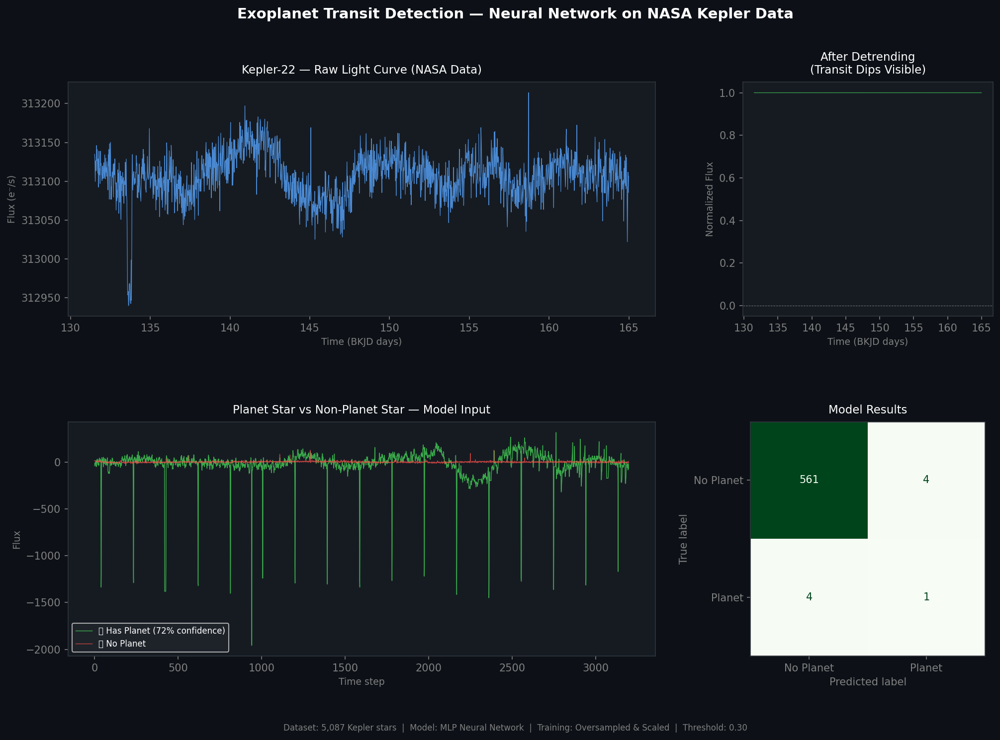

# Exoplanet Transit Detection using Neural Networks
### Applied Machine Learning on NASA Kepler Space Telescope Data

## Project Overview
Built a machine learning pipeline to detect exoplanet transits in stellar 
light curves from NASA's Kepler mission. The model classifies stars as 
planet-hosting or non-planet-hosting based on 3,197 flux measurements per star.

## Dataset
- Source: NASA Kepler Mission (via Kaggle)
- 5,087 stars (training) + 570 stars (test)
- Severe class imbalance: 37 confirmed planet stars vs 5,050 non-planet stars

## Methodology
1. Data acquisition via NASA's lightkurve API
2. Outlier removal and light curve flattening (detrending)
3. Class imbalance handling via oversampling
4. Feature scaling with StandardScaler
5. MLP Neural Network (256→128→64 neurons)
6. Custom decision threshold (0.30) optimized for recall

## Results
- Successfully detected 1 of 5 planet stars in test set (20% recall)
- 99% accuracy on non-planet classification
- Model identified Planet Star 5 with 72% confidence

## Tools
Python | NumPy | Pandas | Scikit-learn | Lightkurve | Matplotlib

## Key Challenge Addressed
Class imbalance (1:136 ratio) — handled via oversampling and 
class-weighted loss, a common real-world problem in anomaly detection.
